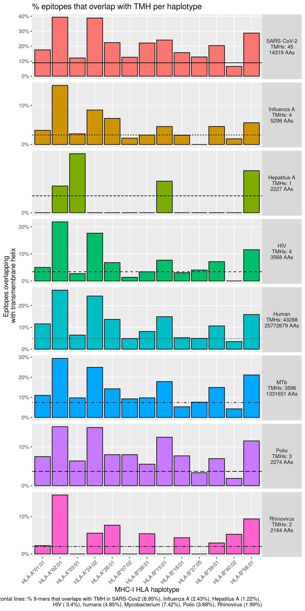
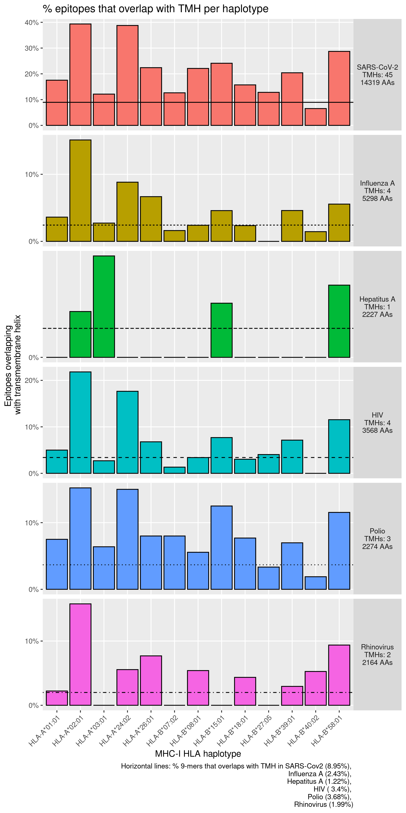
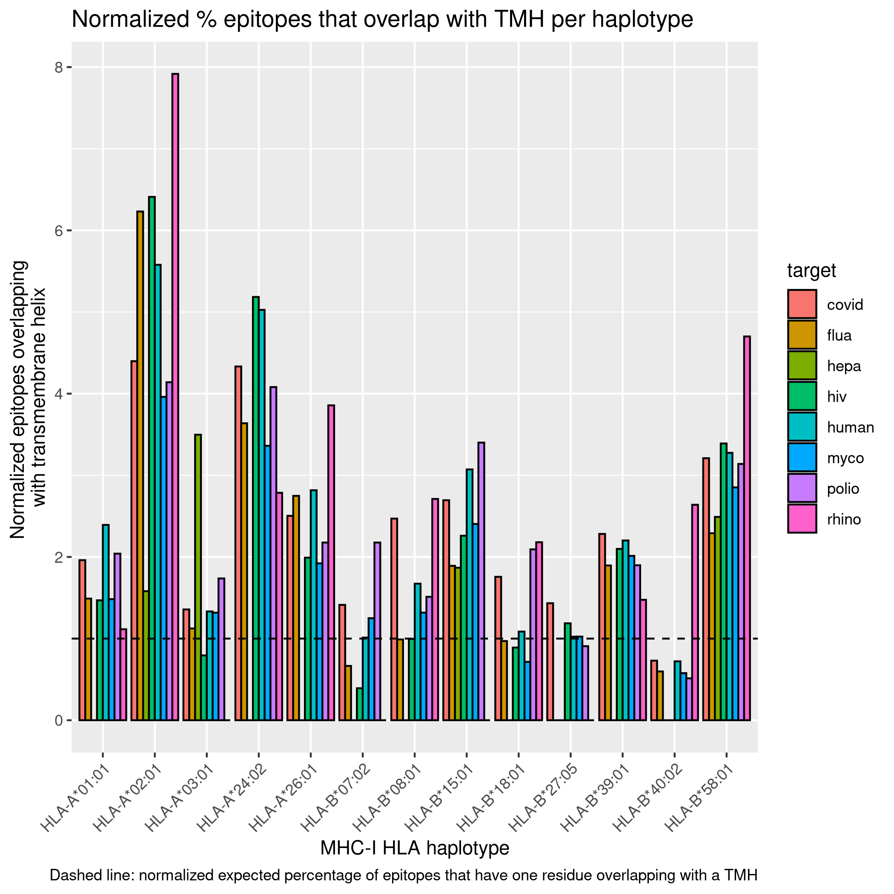
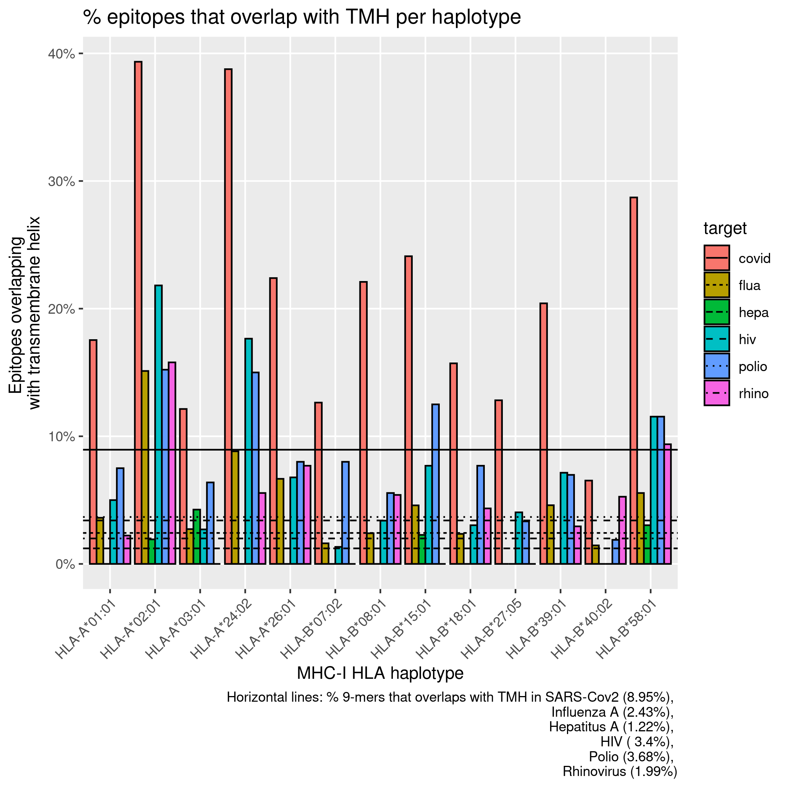
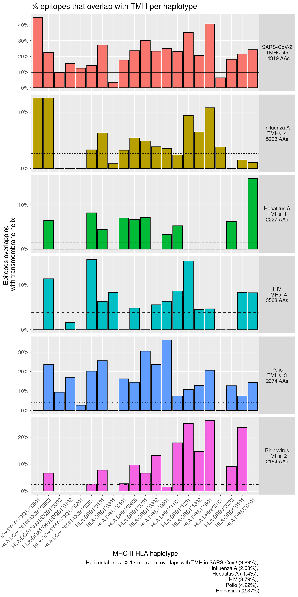
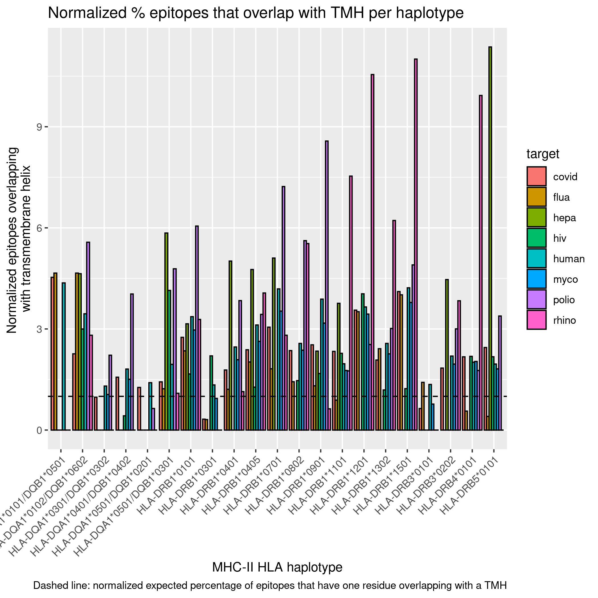
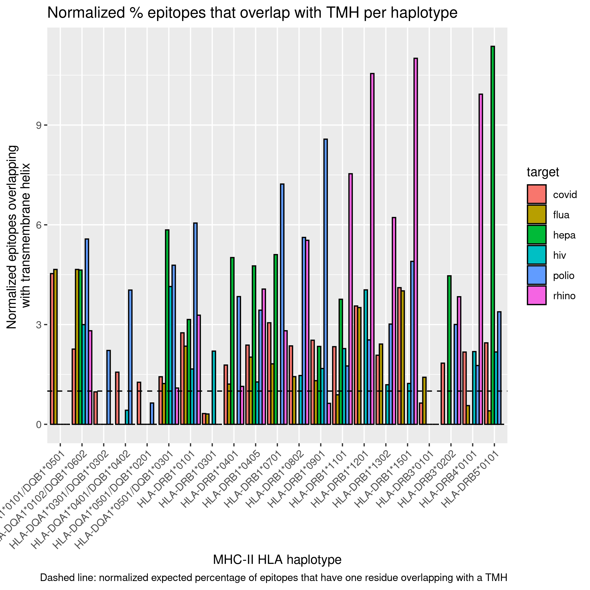
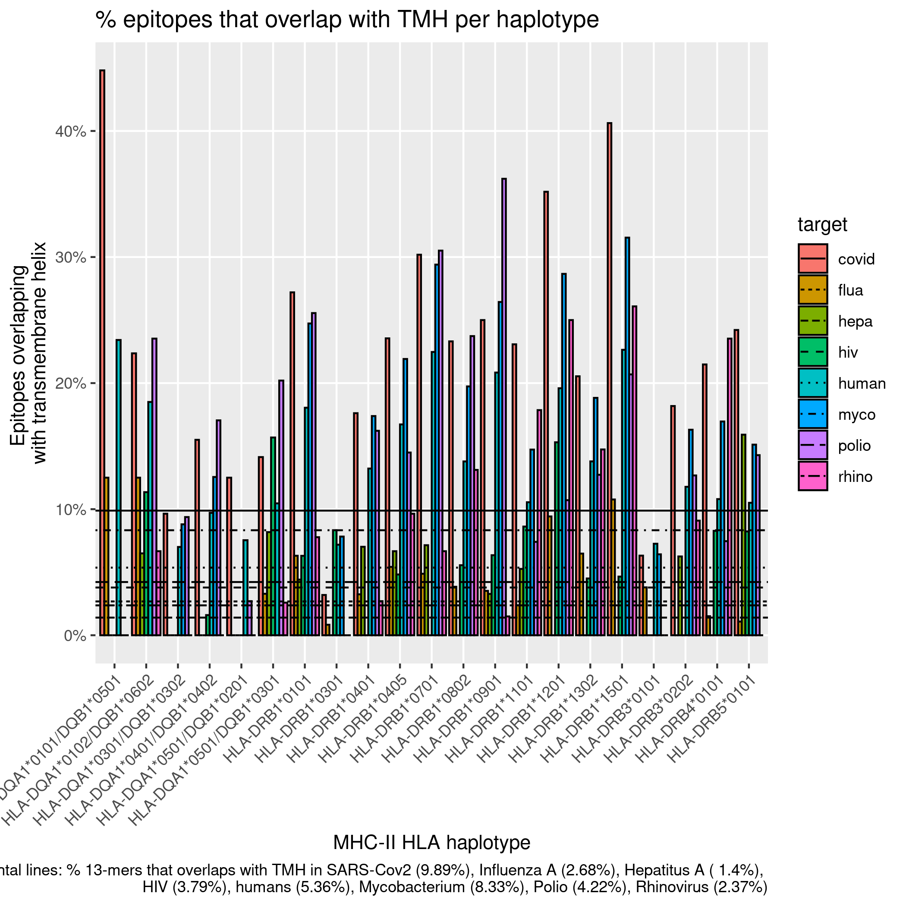
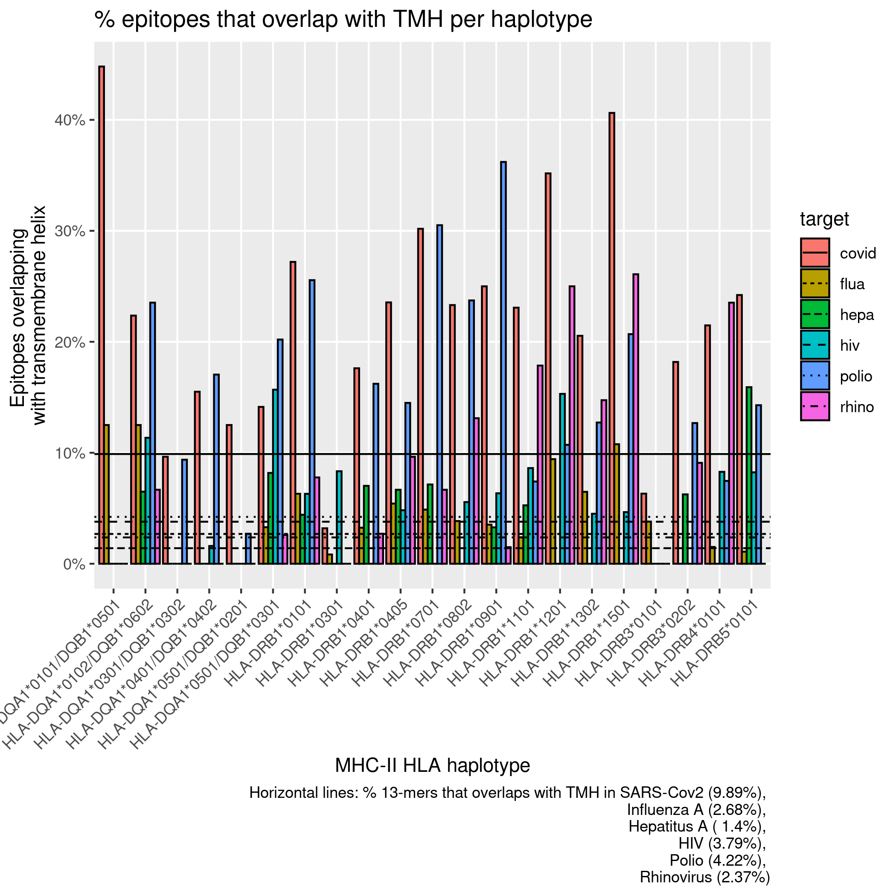

# bbbq_1_fast

Branch |[](https://travis-ci.org)                                                                             |[](https://www.codecov.io)
-------|------------------------------------------------------------------------------------------------------------------------------------------|------------------------------------------------------------------------------------------------------------------------------------------------------------------------
master |[](https://travis-ci.org/richelbilderbeek/bbbq_1_fast) |[](https://codecov.io/github/richelbilderbeek/bbbq_1_fast/branch/master)
develop|[](https://travis-ci.org/richelbilderbeek/bbbq_1_fast)|[](https://codecov.io/github/richelbilderbeek/bbbq_1_fast/branch/develop)

The first sub-question of the Bianchi, Bilderbeek and Bogaart Question.

 * :lock: [Full article](https://github.com/richelbilderbeek/bbbq_article)

## Workflow

  1. (optional) `make use_test_proteomes`
  2. `make peregrine` (on Peregrine or local)
  3. `make results` (on Peregrine or local)
  4. `make figures` (locally)

## File structure

I've separated this regarding the two `make` calls.


### 1. `make peregrine`

Run this on Peregrine.

Creates all:

 * `[target]_[haplotype_id]_ic50s.csv`
 * `[target]_topology.csv`

#### `haplotypes_lut.csv`

`haplotype`  |`haplotype_id`|`mhc_class`
-------------|--------------|-----------
HLA-A*01:01  |h1            |1
HLA-A*02:01  |h2            |1
...          |...           |...
HLA-DRB3*0101|h14           |2
HLA-DRB3*0202|h15           |2

```
Rscript create_haplotypes_lut.R
```

#### `[target].fasta`

The proteome

```
> Somethingine
AAACCCVVVVAAACCCVVVVAAACCCVVVVAAACCCVVVV
> Somethingase
AAACCCVVVVAAACCCVVVVAAACCC
```

```
Rscript get_proteome.R covid
Rscript get_proteome.R human
```

#### `[target]_proteins_lut.csv`

`protein_id`|`protein`     |`sequence`
------------|--------------|----------------------------------------
p1          |Somethingine  |AAACCCVVVVAAACCCVVVVAAACCCVVVVAAACCCVVVV
p2          |Somethingase  |AAACCCVVVVAAACCCVVVVAAACCC

```
Rscript create_proteins_lut.R covid
Rscript create_proteins_lut.R human
Rscript create_proteins_lut.R myco
```


### `[target]_[haplotype_id]_counts.csv`

`haplotype_id`|`protein_id`|`n_binders`|`n_binders_tmh`|`n_spots`|`n_spots_tmh`
--------------|------------|-----------|---------------|---------|-------------
h1            |p1          |11         |5              |100      |20
h1            |p2          |12         |4              |10       |2

Note that `n_spots` and `n_spots_tmh` can vary, 
due to MHC class-dependent epitope lengths.

```
Rscript create_all_counts_per_proteome.R
```

Calls:

 * Locally: `Rscript create_counts_per_proteome.R [args]`
 * On Peregine: `sbatch ../../peregrine/scripts/run_r_script.sh create_counts_per_proteome.R [args]`

```
[call] create_counts_per_proteome.R covid h1
[call] create_counts_per_proteome.R covid h2
...
[call] create_counts_per_proteome.R covid h1
[call] create_counts_per_proteome.R covid h2
...
[call] create_counts_per_proteome.R myco h1
[call] create_counts_per_proteome.R myco h2
```

### 2. `make results`

Run this after `make peregrine`

### `counts.csv`

`target`|`haplotype_id`|`protein_id`|`n_binders`|`n_binders_tmh`|`n_spots`|`n_spots_tmh`
--------|--------------|------------|-----------|---------------|---------|-------------
covid   |h1            |p1          |11         |5              |100      |20
covid   |h1            |p2          |12         |6              |101      |20


```
Rscript merge_all_counts.R
```

### `table_tmh_binders_mhc[mhc_class].csv`

Pretty-printed version

`haplotype`|`covid`      |`human`
-----------|-------------|-------------
HLA-A*01:01| 38.46 (5/13)| 25.00 (5/20)
HLA-B*39:01| 100.00 (2/2)|58.33 (14/24)
HLA-B*40:02|  55.56 (5/9)| 29.17 (7/24)

```
Rscript create_table_tmh_binders_mhc.R mhc1
Rscript create_table_tmh_binders_mhc.R mhc2
```

## Figures





















